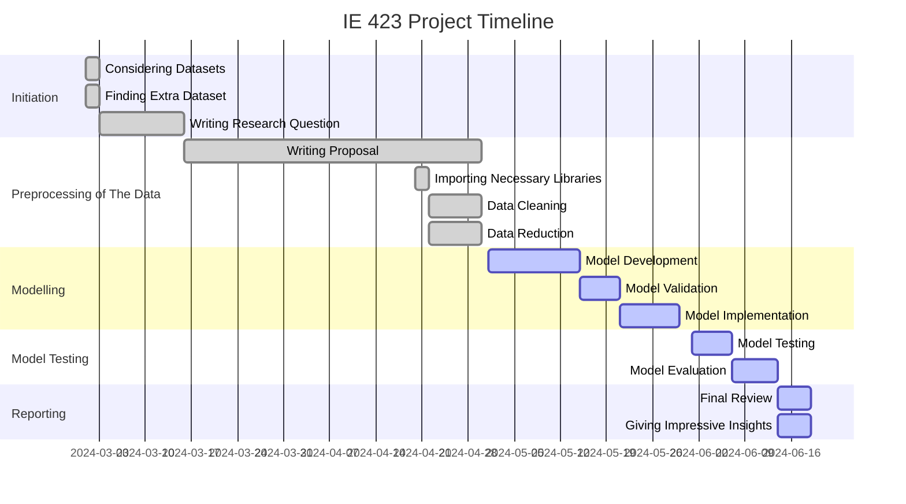

- 120203054 Ayşe Kocavelioğlu
- 120203009 Beril Polat
- 120203068 İlayda Aslan
- 120203039 Sinem Yontar
- 120203058 Şevval Yavaş
  
# The Goal of This Project

This project's goal is to examine three separate datasets from Spotify, Taylor Swift, and TikTok that provide data about music. In order to obtain insight into music preferences, trends, and features across many platforms, the goal is to use machine learning algorithms to find patterns, similarities, and correlations between these datasets. 

Our goal is to create robust machine learning models that can accurately evaluate and predict Taylor Swift's song features, music trends on various platforms, release date, song order and preferences for her new album. We also expect to gain insightful information about the variables that influence song popularity and engagement that Taylor Swift, her producer, and music platforms can apply to their decision-making and content development processes.
From these perspectives, the project can provide insightful information about user behavior, content preferences and market dynamics in the music industry. Ultimately, this will help artists, producers, platforms, and other stakeholders make better decisions and develop more effective strategies.

At the end of our analysis, we will determine if Taylor Swift wants to make a new song, what features should be in this song.  

# Research Questions and Their Aims
1) How do the genres of music used on different platforms affect their popularity?
This analysis aims to provide insight into how musical elements influence viral trends on social media platforms. By comparing data from Spotify and TikTok, we can identify trends in music consumption and popularity across different platforms. This information can help guide advertising campaigns for Taylor Swift. Analyzing TikTok's most popular genres can reveal insights into the preferences of younger audiences, which can be useful for targeting niches in the music industry. This approach to genre classification can help improve machine learning algorithms in music analysis.

2) What makes a song popular?
The music industry is constantly evolving, with digital streaming platforms reshaping the way songs are discovered, consumed and popularized. This analysis aims to measure various musical features and their impact on listeners' perception in order to predict the success of Taylor Swift's new song. This project aims to delve into this area to reveal music popularity over the internet using data science techniques.

3) What are the criteria for numbering the tracks on Taylor Swift’s album?
The purpose of this research is to ensure that the order of the songs in Taylor's new album contributes to a consistent artistic expression. Whether based on emotional or musical dynamics, a thoughtful track numbering strategy can improve the listener's overall listening experience. A well-structured album of sequences can be more memorable and effective. It increases its popularity by leaving a mark on the listeners

4) Can the popularity of Taylor Swift’s songs be determined by the season in which they were released? 
The purpose of this research question is to ensure that Taylor can strategically determine the release date of her album to maximize its impact by utilizing analysis of seasonal trends. Releasing songs during seasons or times of year when they have historically been more popular can increase their visibility and attract audience attention. In this way, with its knowledge of seasonal preferences, it can shape its marketing and promotional activities accordingly.

## Inputs
- Spotify Songs Dataset (spotify_songs.csv)
- Taylor Swift Dataset (taylorswift-Features.csv and taylorswift-Tracks.csv)
- TikTok Dataset

## Outputs
- Identification of common patterns: Determine if there are common trends or patterns across the three datasets, such as preferred genres, popular tracks, or characteristic audio features.
- Genre classification: Develop a machine learning model to classify songs into genres based on their audio features. Evaluate the model's performance using cross-validation techniques.
- Predictive modeling: Build predictive models to forecast track popularity or engagement on platforms like Spotify and TikTok based on audio features, artist, and album information.
- Feature importance analysis: Determine which audio features contribute most to track popularity or engagement on different platforms, providing insights for artists and producers.

## Preprocessing Steps
For research question 1, "How do the genres of music used on different platforms affect their popularity?" TikTok dataset was used. Preprocessing starts by importing essential libraries: pandas. These libraries are crucial for data manipulation and numerical operations. The dataset is loaded using pd.read_csv(). Missing values ​​are identified using isnull().sum(). Depending on the data, these missing values ​​are either filled using methods like fillna() or dropped using dropna(), ensuring the dataset is complete and ready for analysis. Duplicate rows are checked using df.duplicated().any(). At the end of preprocessing we ensure that data is clean and free from missing values ​​is crucial for accurate analysis.

For research question 2 (Q2) which is "What makes a song popular?", "spotify_songs.csv" dataset was used. The process started by installing and importing the necessary 'pandas' library for preprocessing the spotify songs dataset. The dataset was then loaded into a DataFrame named 'spotify_songs', and its structure was explored by displaying the columns, the first few rows, and general information about the dataset, including and dropping rows with any missing values, resulting in the 'data_cleaned' DataFrame. To prepare the data for modeling, categorical variables such as 'playlist_genre', playlist_subgenre', and 'mode' were converted into numerical format using one-hot encoding, creating the 'data_encoded' DataFrame. A binary target variable 'hit', was introduced to classify songs as hits if their 'track_popularity' was 70 or higher. Finally, columns that were not necessary for the modelling process, including various identifiers and names, were removed. This resulted in the 'data_model' DataFrame, which contains the cleaned, encoded, and structured data ready for further analysis. 

The third and fourth research question answers includes a preprocessing step too for the Taylor Swift data. The 'preprocessData' function in Python is designed to prepare a music track dataset for machine learning by extracting and engineering various features. It begins by copying the original DataFrame and then extracting seasonal information from the release dates, converting months to seasons, and mapping these seasons to numerical values. Additionally, it extracts the month, weekday, and year from the release dates. The function calculates the first release date for each album and determines the days since the previous album's release, incorporating this information back into the DataFrame. It counts the number of tracks per album and adds this count as a new feature. To capture interactions between key audio features, polynomial features are generated and merged with the main DataFrame. Finally, the function drops unnecessary columns, retains only numerical data, and splits the dataset into features (X) and the target variable (y), readying it for machine learning modeling.

# About The Next Steps and Gantt Chart
First of all, as we did the preprocessing of the data, we will develop a model for our case which is suitable. Then, we will validate our model and implement it. After these steps are completed, we will test the model and evaluate this model to see if the chosen model is the best or not. As a consequence, after completing final review, it will be available for us to give impressive insight based on our analysis.

    

# The Journey of Predicting Music Popularity: A Data Story

Imagine delving into the realm of music data in order to unearth intriguing revelations. What impact do the musical genres utilized on various platforms have on a song's popularity? Why does a song become popular? Let's examine Taylor Swift's discography in particular. What standards are used to assign track numbers to her albums? And does the season in which her songs were released affect how well-liked they are? In order to address these concerns, we will examine trends in track numbering, the effect of genres on different platforms, and seasonal patterns in song popularity by analyzing a dataset that includes information on Taylor Swift's songs. We'll learn more about the elements that influence a song's popularity and the calculated choices that go into album track lists thanks to this investigation. We made 4 different analysis, we will tell you one by one. 

First of all, music transcends borders, speaking directly to the soul. But what makes certain songs soar in popularity while others remain unnoticed? This model dives into the heart of this mystery using machine learning, clustering music genres, predicting them for a new dataset, and finally forecasting song popularity.
Our adventure begins with the rich trove of Spotify data, teeming with audio features such as 'energy', 'speechiness', 'acousticness', 'instrumentalness', 'liveness', 'valence', 'tempo', and 'danceability'. These attributes provided a nuanced picture of each song's acoustic profile. We also gathered a separate dataset from TikTok to expand our analysis.
Ensuring consistency, we standardized the data. This crucial step prepared our dataset for the complex task of clustering, which aimed to reveal inherent patterns within the music.
Using Spotify data, we applied clustering algorithms to group similar genres. This involved:
Loading and Standardizing Data: Ensuring consistency and comparability across songs.
Determining Clusters: Using the Elbow Method to find the optimal number of clusters.
Applying K-Means Clustering: Revealing genre groupings with similar acoustic features.

+ 

+ 

The outcome was a dataset where each song was assigned to a cluster, unveiling patterns and relationships within the music. For instance, songs with high energy and danceability often clustered together, pointing to genres like pop and dance music.
With our clustering model trained, we predicted genres for TikTok songs. We input the audio features into our model and obtained predicted genre clusters for the TikTok data.

+ 

Analyzing the predicted genres, we discovered how different genres fared in popularity on TikTok:
R&B and Rock emerged as the leaders, captivating listeners with average popularity scores of 64.16 and 64.14, respectively. Latin (61.60) and Pop (60.39) also showed strong appeal. Rap (56.92) and EDM (52.04) lagged slightly behind.

+ 

+ 

This insight into genre popularity revealed fascinating trends and audience preferences.
We then built a Random Forest model to predict song popularity, using both audio features and genre information. This powerful model enabled us to forecast potential hits based on their acoustic characteristics.
The model's input features included 'energy', 'speechiness', 'acousticness', 'instrumentalness', 'liveness', 'valence', 'tempo', 'danceability', and the predicted genre. The Random Forest algorithm, known for its robustness and accuracy, processed these features to predict a song’s popularity score.
Our predictions provided a glimpse into the future of music trends. For example, a song with high energy and danceability, categorized under pop, might have a higher chance of becoming a hit. This predictive power is invaluable for music producers and marketers, helping them tailor their strategies to align with audience preferences.
Our model showcases a comprehensive approach to understanding and predicting music popularity. By clustering genres, predicting them for a new dataset, and analyzing their relationship with popularity, we provided valuable insights into what makes a song a hit. Our final Random Forest model stands as a robust tool for predicting future music trends, aiding Taylor Swift and  music producers and marketers in navigating the dynamic world of music.

Secondly, in today's music industry, understanding what makes a song popular is crucial for artists aiming to create impactful music. Leveraging Spotify data, our analysis delved into key factors influencing a song's success, employing advanced machine learning techniques to uncover patterns that define hit songs. After meticulously cleaning and preprocessing the dataset, which included encoding categorical variables and handling missing values, we proceeded with modeling.
Our study employed three robust classifiers: logistic regression, random forest, and gradient boosting machine. These models were trained to predict whether a song would achieve a popularity threshold of 70 on Spotify, translating this prediction into a binary outcome (hit or non-hit). Each model underwent rigorous evaluation, measuring accuracy, and generating detailed confusion matrices that depicted how well predictions aligned with actual outcomes.
Among the models tested, gradient boosting machine emerged as the most accurate, achieving an impressive accuracy score of approximately 86.5%. This model excelled in correctly identifying hit songs, as evidenced by its strong performance in the confusion matrix and its high area under the ROC curve. Random forest also demonstrated robust predictive power, closely following gradient boosting machine in performance metrics.

+ 

Delving deeper into feature importance, both models highlighted certain musical attributes as critical for song popularity. Key factors included the duration of the song, its energy level, danceability, and loudness. These findings suggest that songs with optimal duration, high energy, and danceable beats tend to resonate more with listeners, potentially enhancing their chances of becoming hits.

+ 

+ 

Our analysis provides actionable insights for artists like Taylor Swift who are keen on crafting songs with broad appeal. By focusing on these pivotal musical characteristics identified through data-driven approaches, artists can enhance their chances of producing commercially successful music that resonates deeply with audiences on platforms like Spotify. This data-driven approach not only aids in understanding current trends but also guides future artistic decisions to optimize impact and engagement in the competitive landscape of the music industry.

Lastly, let’s get into the art of track order and seasonal success. Taylor Swift's albums are more than just collections of songs—they're carefully crafted journeys that invite listeners into her world. When exploring the numbering of tracks on her albums, it's evident that there's no simple formula to predict popularity. Each album tells a unique story, and the arrangement of tracks plays a crucial role in that narrative.
Consider the diverse popularity patterns across her albums. The image below, a vibrant line graph, illustrates that no single track number consistently outshines the others. Instead, peaks and valleys in popularity vary, highlighting an intriguing trend: Taylor Swift’s music resonates differently across each album, regardless of the track order. This variability suggests that she prioritizes artistic flow and thematic cohesion over positioning potential hits in specific slots.

+ 

Supporting this, the correlation matrix reveals a fascinating insight—track_number shows minimal correlation with popularity. This underscores that the decision on track placement isn't driven by expected popularity.

+ 

While the order of tracks on an album follows an artistic logic, the timing of their release is a different story—a strategic masterpiece in its own right. The bar plot below highlights a strong positive correlation between release_date and popularity.

+  

Dive deeper, and the correlation matrix reinforces this finding. release_date is a standout feature positively influencing a song’s popularity. This isn't just happenstance. Releasing songs during certain times of the year—think festive holidays, vibrant summers, or even around significant events—can amplify their reach and resonance. During these periods, listeners are more engaged, creating a fertile ground for new releases to thrive.
Taylor Swift’s approach to her music is a blend of meticulous artistry and strategic acumen. Meanwhile, the timing of her releases demonstrates a keen understanding of market dynamics, ensuring her music not only reaches but resonates with her audience. This focus on artistic integrity and strategic release timing is what sets her apart, making her music not just popular, but timeless.

+ 

+ 

Let’s delve into the artistry behind her track order and release timing (season), revealing the subtle yet powerful strategies that make her music resonate across the globe. As the album progresses, there’s a noticeable shift. The tempo picks up, and the beats become more pronounced. By the midway point, the songs are not just heard—they’re felt. The correlation matrix underscores that track number is negatively related to energy, danceability, and loudness. Further, the correlation matrix underscores this point, revealing that the release date is a key factor in a song’s popularity. By strategically timing releases to coincide with high listener engagement periods, they ensure that each song not only reaches but also resonates with its audience. This savvy approach transforms release dates into powerful catalysts for a song’s success, turning each new release into a cultural moment.

+ 

Another intriguing trend emerges as you move towards the end of the album. The explicit content in the lyrics tends to increase, aligning with the surge in energy and boldness. This deliberate progression suggests a narrative arc that grows in intensity, echoing the broader themes and emotions Taylor explores. The tracks towards the end are not just louder and more energetic—they’re also more daring, both musically and lyrically.
What’s more, if the result of Taylor Swift compared with another artist like Shawn Mendes, we can see that the release_date is the most important effector of the popularity.

+ 

In essence, Taylor Swift’s artistry is a harmonious blend of meticulous planning and creative brilliance. Her music is a testament to the power of sound, making her not just a pop sensation, but a timeless artist whose work continues to resonate with fans old and new.

## Recommendation

When everything get into account, for Taylor Swift's upcoming album, which should be out in the fall season to be popular, we suggest concentrating on the R&B genre, which is now trending on TikTok, in order to write an unforgettable song. To keep listeners interested, the song should be quite energetic and include a modest amount of speechiness to balance the lyrical substance. Furthermore, a valence score—which indicates a good emotional tone—is essential since songs that arouse pleasant feelings tend to do better. These elements allow Taylor Swift to write a song that speaks to the contemporary music landscape, captivating listeners and gaining broad appeal.

